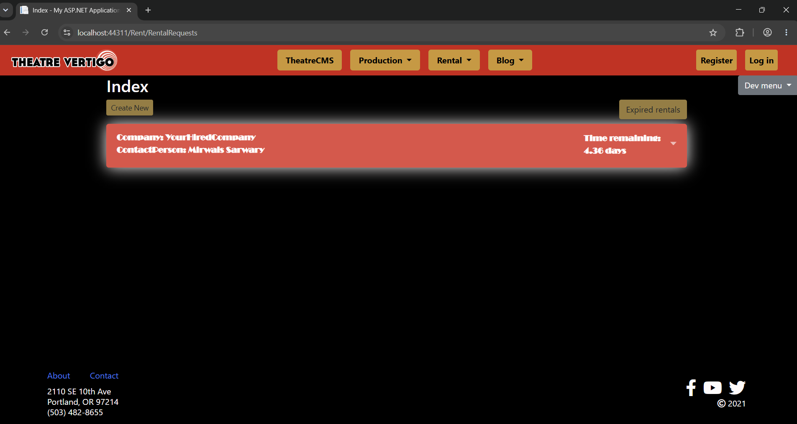
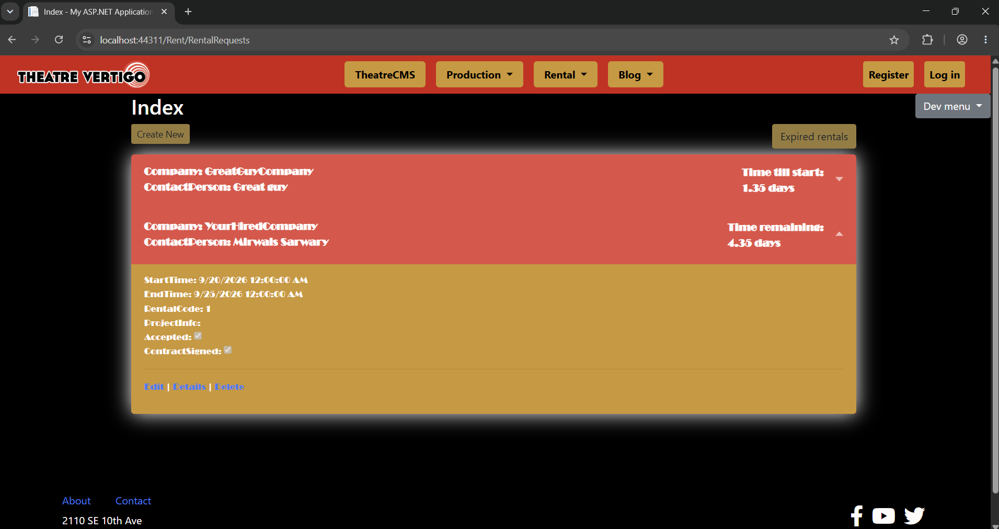
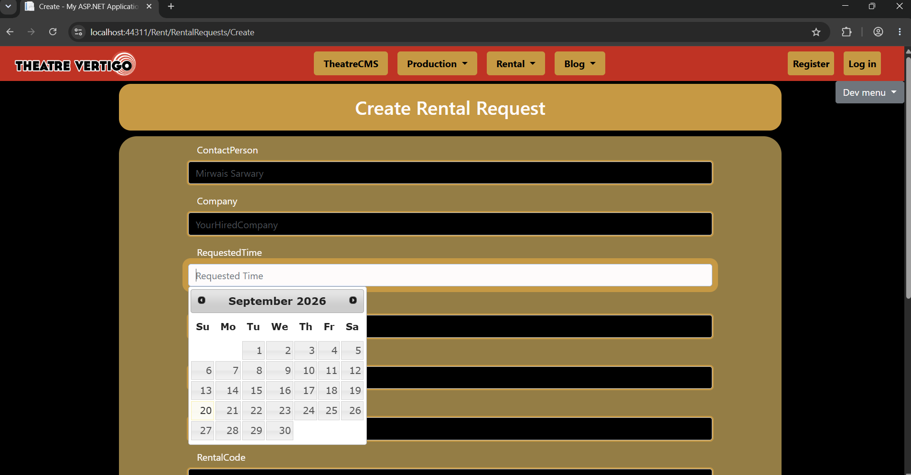

# Theatre Vertigo — Rental Request CMS

ASP.NET MVC + Entity Framework module for managing venue / production **rental requests** for a theater company (Theatre Vertigo).

**My role:** On The Tech Academy live-project team, I owned the **rental request** feature end-to-end — Entity Framework model, full CRUD under the `Rent` area, index sorting by start time, automatic expiry marking (7 days after end), accordion cards with time-till-start / time-remaining, current-vs-expired toggle, and date-picker UX on create/edit.

> **Live demo:** _coming soon (Azure App Service after secrets scrub)_

## Screenshots

Index — current rentals with live countdown:



Index — accordion card expanded:



Create — new rental request form:



## Tech stack

| Layer | Tools |
| --- | --- |
| Language | C# |
| Web | ASP.NET MVC (Areas: `Rent`) |
| ORM / data | Entity Framework |
| IDE | Visual Studio Code (edit) / Visual Studio (run & debug) |
| Collaboration | Azure DevOps (team board / stories) |
| Front-end UX | CSS accordion cards, current/expired toggle, DateTime display math in Razor, jQuery UI datepicker |


## What I built (features)

- **Rental request data model + CRUD** — `RentalRequest` entity (`ContactPerson`, `Company`, `StartTime` / `EndTime`, `Accepted`, `ContractSigned`, `Expired`, …) and `RentalRequestsController` with Create / Details / Edit / Delete under `Areas/Rent`.
- **Index sort + expiry rules** — Load requests, sort by `StartTime`, and mark a request `Expired` once it is at least **7 days** past `EndTime` (persisted back to the database).
- **Accordion index with status-aware countdowns** — Each card expands via checkbox/label accordion UI. Branches show **time till start**, **time remaining**, **expired**, or **grace week** (expires on day 7), with a button to toggle current vs expired rentals.
- **Create / Edit date pickers** — jQuery UI `datepicker()` on request date fields so staff pick dates instead of typing free-form DateTimes.

## Code highlights

### 1. Controller — sort + 7-day expiry (`RentalRequestsController.Index`)

```csharp
var sortedRequests = db.RentalRequests.ToList();
sortedRequests.Sort((x, y) => DateTime.Compare(y.StartTime, x.StartTime));

foreach (var item in sortedRequests)
{
    // A week after its last date, a rental request is considered expired.
    if (item.EndTime < DateTime.Now)
    {
        double daysExpired = Convert.ToDouble((DateTime.Now - item.EndTime).TotalDays);
        if (daysExpired >= 7.00)
        {
            item.Expired = true;
            db.SaveChanges();
            continue;
        }
        item.Expired = false;
        db.SaveChanges();
    }
}

return View(sortedRequests);
```

**Why it mattered:** Ordering by start time and flipping `Expired` after a grace week keeps the list honest as old requests pile up.

### 2. Index view — accordion card + time-till-start (`Index.cshtml`)

```cshtml
<button id="rentReqToggleBtn" type="button"
        onclick="RentRequestCurrentExpire()">
    Expired rentals
</button>

@foreach (var item in Model)
{
    if (item.StartTime > DateTime.Now)
    {
        <div class="RRCurrentCard">
            <input type="checkbox" name="RentalRequest_accordion"
                   id="@item.RentalRequestID"
                   class="rentalRequests-Index--accordionInput" />
            <label for="@item.RentalRequestID"
                   class="rentalRequests-Index--accordionLabel">
                Company: @item.Company
                @{
                    var timeTillRentStarts = (item.StartTime - DateTime.Now).TotalDays;
                    var tStart = $"{timeTillRentStarts:0.00}";
                }
                <span>Time till start: @tStart days</span>
            </label>
            @* accordion body: Start/End, code, project info, Edit/Details/Delete *@
        </div>
    }
    @* else: time remaining | Expired! | Expires on Day 7 *@
}
```

**Why it mattered:** Staff can scan status at a glance without opening every row — the accordion keeps detail one click away.

### 3. Create view — jQuery UI date pickers (`Create.cshtml`)

```javascript
$(function () {
    $("#RequestedTime").datepicker();
    $("#StartTime").datepicker();
    $("#EndTime").datepicker();
});
```

**Why it mattered:** Free-typed DateTimes are easy to mistype; a picker speeds entry and cuts validation noise on the create form.

## Project layout (rental slice)

```
TheatreCMS3/
  Areas/Rent/
    Controllers/RentalRequestsController.cs
    Models/RentalRequest.cs
    Views/RentalRequests/   (Index, Create, Edit, Details, Delete)
```

Full solution: `TTA_Csharp_LiveProject` / `TheatreCMS3`. Other areas of the site were owned by teammates.

## Team context

Built as part of a multi-developer Tech Academy live project. I focused on the rental-request slice; work was tracked in Azure DevOps. Public materials describe **my** contribution clearly; the rest of the CMS is team-built.

## What I learned

- **Area routing vs relative URLs (bug → fix):** The Index **Create New** button used a hand-written relative link: `href="../RentalRequests/Create"`. That is browser path math, not MVC routing. From the Index URL `/Rent/RentalRequests` (no trailing slash), the browser treats `RentalRequests` like a file under `/Rent/`, so `../` climbs to the site root and the link becomes `/RentalRequests/Create` — **dropping the `Rent` area**. Create then missed the Area route. I replaced Create New (and Create’s **Back to List**, which had the same `../` pattern) with `Url.Action("Create", "RentalRequests", new { area = "Rent" })` (and the matching Index action). MVC’s route table now builds `/Rent/RentalRequests/Create` from action + controller + area. That is more effective because: (1) it always includes the Area prefix, (2) it stays correct if the current URL is `/Rent/RentalRequests`, `/Rent/RentalRequests/`, or `/Rent/RentalRequests/Index`, and (3) it matches how the rest of the CRUD links are meant to be generated — the framework owns the URL instead of the browser guessing a relative path.
- **Working in a shared ASP.NET codebase:** Building only the `Rent` / rental-request slice meant matching existing Area patterns, models, and naming so my CRUD pages fit the Theatre Vertigo CMS instead of living as a one-off feature.
- **Turning stories into usable UI:** Sorting by start time, marking requests expired after a 7-day grace period, and showing time-till-start / time-remaining on accordion cards made the Index useful for staff scanning a growing list — not just a raw database dump.


## How to run locally

1. **Prerequisites:** Visual Studio 2019+ with ASP.NET / .NET Framework workload, SQL Server LocalDB (or SQL Express). VS Code is fine for editing.
2. Open `TTA_Csharp_LiveProject` / `TheatreCMS3.sln`.
3. Restore NuGet packages.
4. Confirm `Web.config` uses your LocalDB attach path (do not commit shared course credentials).
5. Set `TheatreCMS3` as the startup project, press F5 (IIS Express).
6. Open Rent → Rental Requests (`/Rent/RentalRequests`).

## Notes

Team live-project codebase from The Tech Academy. Before any public host: scrub connection strings and secrets; use demo / seed data only. Screenshot set omits older expired-sample data so the README stays current.
